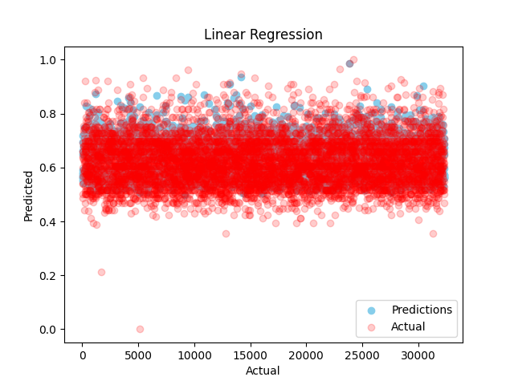
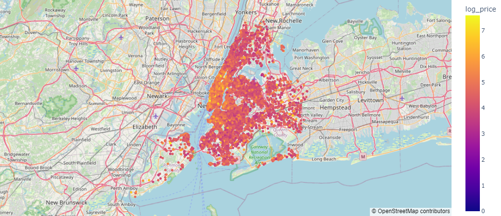

# NYC-Airbnb-Price-Forecasting

This project aims to forecast prices for Airbnb listings in New York City using machine learning models.

The dataset is sourced from [Kaggle](https://www.kaggle.com/datasets/lovishbansal123/airbnb-data/data)

MSE results on different kind of regression models:

| Regression Model | Train Score | Test Score |
|------------------|-------------|------------|
| Linear Regression | 0.0035      | 0.0037     |
| Decision Tree    | 0.0313      | 0.0584     |
| SVR              | 0.0036      | 0.0038     |

## Linear Regression Model Plot:

## Map of NYC Airbnb Prices:

